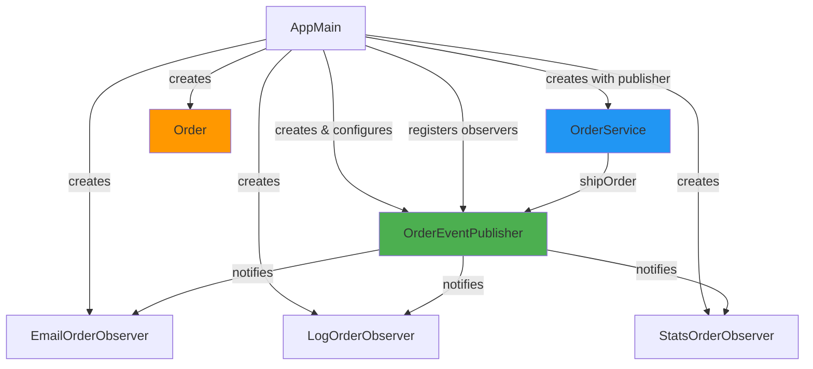
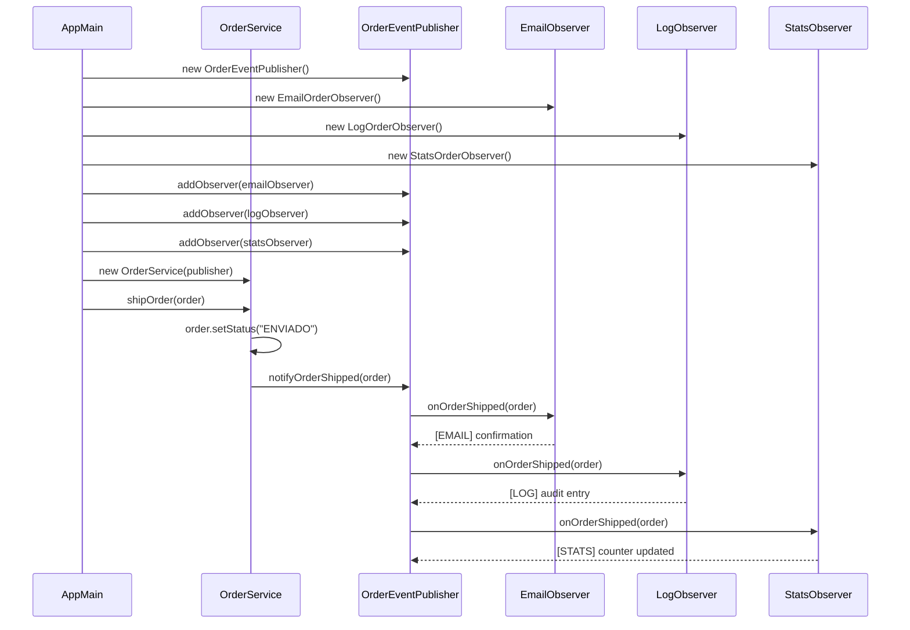

## System Overview

The Order System is a Java-based implementation of the Observer pattern designed for e-commerce order notifications. When an order is shipped, multiple independent actions are triggered automatically without tight coupling between components.

<Info>
  This architecture demonstrates how to build **extensible, maintainable systems** using behavioral design patterns.
</Info>

## Architecture Diagram



## Core Components

### 1. Domain Model: Order

The `Order` class represents the core business entity:

```java Order.java
@Getter
@Setter
public class Order {
    private String id;
    private String status; // "CREADO", "ENVIADO", etc.

    public Order(String id) {
        this.id = id;
        this.status = "CREADO";
    }
}
```

<Note>
  The Order class uses Lombok annotations (`@Getter`, `@Setter`) to automatically generate getters and setters, reducing boilerplate code.
</Note>

**Responsibilities:**
- Store order information (ID, status)
- Maintain order state throughout its lifecycle
- Provide simple data access

### 2. Subject Layer

The subject layer defines the contract and implementation for managing observers.

<Accordion title="OrderSubject Interface">
  Defines the operations that any order event publisher must support:
  
  ```java OrderSubject.java
  public interface OrderSubject {
      void addObserver(OrderObserver observer);
      void removeObserver(OrderObserver observer);
      void notifyOrderShipped(Order order);
  }
  ```
  
  This interface enforces the **Dependency Inversion Principle** - high-level modules depend on abstractions, not concrete implementations.
</Accordion>

<Accordion title="OrderEventPublisher Implementation">
  The concrete implementation that manages the observer list:
  
  ```java OrderEventPublisher.java
  public class OrderEventPublisher implements OrderSubject {
      private final List<OrderObserver> observers = new ArrayList<>();

      @Override
      public void addObserver(OrderObserver observer) {
          observers.add(observer);
      }

      @Override
      public void removeObserver(OrderObserver observer) {
          observers.remove(observer);
      }

      @Override
      public void notifyOrderShipped(Order order) {
          for (OrderObserver observer : observers) {
              observer.onOrderShipped(order);
          }
      }
  }
  ```
  
  **Key Features:**
  - Maintains an internal list of observers
  - Provides thread-safe add/remove operations (consider `CopyOnWriteArrayList` for concurrent environments)
  - Broadcasts events to all registered observers
</Accordion>

### 3. Observer Layer

The observer layer defines how components react to order events.

<Accordion title="OrderObserver Interface">
  The contract all observers must implement:
  
  ```java OrderObserver.java
  public interface OrderObserver {
      void onOrderShipped(Order order);
  }
  ```
  
  This simple interface ensures **polymorphism** - the subject can work with any observer implementation.
</Accordion>

<Accordion title="EmailOrderObserver">
  Handles customer email notifications:
  
  ```java EmailOrderObserver.java
  public class EmailOrderObserver implements OrderObserver {
      @Override
      public void onOrderShipped(Order order) {
          System.out.println("[EMAIL] Pedido " + order.getId() + " enviado. Mandando email al cliente.");
      }
  }
  ```
  
  **Responsibility:** Send shipping confirmation emails with tracking information.
  
  <Warning>
    In production, this would integrate with an email service (SendGrid, AWS SES, etc.) instead of using `System.out.println`.
  </Warning>
</Accordion>

<Accordion title="LogOrderObserver">
  Records events in the audit trail:
  
  ```java LogOrderObserver.java
  public class LogOrderObserver implements OrderObserver {
      @Override
      public void onOrderShipped(Order order) {
          System.out.println("[LOG] Pedido " + order.getId() + " ha cambiado a estado: " + order.getStatus());
      }
  }
  ```
  
  **Responsibility:** Maintain audit logs for compliance and debugging.
  
  <Info>
    In production, this would use a logging framework like SLF4J, Log4j, or write to a database.
  </Info>
</Accordion>

<Accordion title="StatsOrderObserver">
  Maintains shipping statistics:
  
  ```java StatsOrderObserver.java
  public class StatsOrderObserver implements OrderObserver {
      private int totalEnviados = 0;

      @Override
      public void onOrderShipped(Order order) {
          totalEnviados++;
          System.out.println("[STATS] Contador de pedidos enviados: " + totalEnviados);
      }
  }
  ```
  
  **Responsibility:** Track metrics and analytics for business intelligence.
  
  <Note>
    This observer maintains state (the counter), demonstrating that observers can be stateful.
  </Note>
</Accordion>

### 4. Service Layer: OrderService

The service layer contains business logic and orchestrates order operations:

```java OrderService.java
public class OrderService {
    private final OrderSubject orderSubject;

    public OrderService(OrderSubject orderSubject) {
        this.orderSubject = orderSubject;
    }

    public void shipOrder(Order order) {
        // Business logic: update order status
        order.setStatus("ENVIADO");
        System.out.println("OrderService: Pedido " + order.getId() + " marcado como ENVIADO.");

        // Trigger notifications to all observers
        orderSubject.notifyOrderShipped(order);
    }
}
```

**Key Design Decisions:**

<Steps>
  <Step title="Dependency Injection">
    The `OrderSubject` is injected via constructor, following the **Dependency Injection** principle. This makes the service testable and flexible.
  </Step>
  
  <Step title="Single Responsibility">
    The service focuses on order business logic. It doesn't know about emails, logs, or stats - it just notifies the subject.
  </Step>
  
  <Step title="Open for Extension">
    You can add new observers without modifying this class, following the **Open/Closed Principle**.
  </Step>
</Steps>

### 5. Application Entry Point: AppMain

The main class bootstraps and configures the entire system:

```java AppMain.java
public class AppMain {
    public static void main(String[] args) {
        // 1) Create the Subject (publisher)
        OrderSubject publisher = new OrderEventPublisher();

        // 2) Create observers
        OrderObserver emailObserver = new EmailOrderObserver();
        OrderObserver logObserver = new LogOrderObserver();
        OrderObserver statsObserver = new StatsOrderObserver();

        // 3) Subscribe observers to the subject
        publisher.addObserver(emailObserver);
        publisher.addObserver(logObserver);
        publisher.addObserver(statsObserver);

        // 4) Create the service with the publisher
        OrderService orderService = new OrderService(publisher);

        // 5) Create and ship an order
        Order order = new Order("ORD-001");
        orderService.shipOrder(order);
    }
}
```

<Info>
  In a production application, this configuration would typically be handled by a dependency injection framework like Spring, CDI, or Guice.
</Info>

## Data Flow

Here's how data flows through the system when an order is shipped:

<Steps>
  <Step title="Order Creation">
    An `Order` object is created with an ID and initial status of "CREADO".
  </Step>
  
  <Step title="Service Invocation">
    `AppMain` calls `orderService.shipOrder(order)` to mark the order as shipped.
  </Step>
  
  <Step title="Status Update">
    `OrderService` updates the order status to "ENVIADO" and performs any necessary business logic.
  </Step>
  
  <Step title="Event Publication">
    `OrderService` calls `orderSubject.notifyOrderShipped(order)` to broadcast the event.
  </Step>
  
  <Step title="Observer Notification Loop">
    `OrderEventPublisher` iterates through all registered observers and calls `onOrderShipped(order)` on each.
  </Step>
  
  <Step title="Observer Reactions">
    Each observer executes its specific logic:
    - `EmailOrderObserver` sends an email
    - `LogOrderObserver` records the event
    - `StatsOrderObserver` increments the counter
  </Step>
</Steps>

## Sequence Diagram



## Design Principles Applied

<CardGroup cols={2}>
  <Card title="Single Responsibility Principle" icon="1">
    Each class has one reason to change:
    - `Order`: Changes only if order data structure changes
    - `OrderService`: Changes only if shipping logic changes
    - Each observer: Changes only if its specific notification logic changes
  </Card>
  
  <Card title="Open/Closed Principle" icon="2">
    The system is open for extension (add new observers) but closed for modification (no need to change existing code).
  </Card>
  
  <Card title="Liskov Substitution Principle" icon="3">
    Any implementation of `OrderObserver` can be used interchangeably without affecting the subject's behavior.
  </Card>
  
  <Card title="Dependency Inversion Principle" icon="4">
    `OrderService` depends on the `OrderSubject` abstraction, not the concrete `OrderEventPublisher` implementation.
  </Card>
</CardGroup>

## Component Relationships

### Coupling Analysis

<CardGroup cols={3}>
  <Card title="Tightly Coupled" icon="link">
    - `OrderEventPublisher` → `OrderSubject` (implementation)
    - Each Observer → `OrderObserver` (implementation)
  </Card>
  
  <Card title="Loosely Coupled" icon="link-slash">
    - `OrderService` → `OrderSubject` (interface only)
    - `OrderEventPublisher` → `OrderObserver` (interface only)
    - Observers don't know about each other
  </Card>
  
  <Card title="No Coupling" icon="unlink">
    - `EmailObserver` ← → `LogObserver`
    - `EmailObserver` ← → `StatsObserver`
    - `LogObserver` ← → `StatsObserver`
  </Card>
</CardGroup>

<Info>
  This loose coupling is the primary benefit of the Observer pattern - components can evolve independently.
</Info>

## Extending the Architecture

The architecture is designed for easy extension:

### Adding a New Observer

<Steps>
  <Step title="Create Observer Class">
    Implement the `OrderObserver` interface:
    
    ```java
    public class PushNotificationObserver implements OrderObserver {
        @Override
        public void onOrderShipped(Order order) {
            // Send push notification to mobile app
        }
    }
    ```
  </Step>
  
  <Step title="Register in AppMain">
    Add it to the publisher:
    
    ```java
    OrderObserver pushObserver = new PushNotificationObserver();
    publisher.addObserver(pushObserver);
    ```
  </Step>
  
  <Step title="That's It!">
    No changes needed to `OrderService`, `OrderEventPublisher`, or any other component.
  </Step>
</Steps>

### Adding New Event Types

To support events beyond "order shipped":

1. Add methods to `OrderSubject`: `notifyOrderCancelled()`, `notifyOrderDelivered()`, etc.
2. Add corresponding methods to `OrderObserver`
3. Implement the new methods in concrete observers
4. Call the new notify methods from `OrderService`

<Warning>
  Be careful not to create a "god interface" with too many methods. Consider using separate observer interfaces for different event types if you have many events.
</Warning>

## Threading Considerations

<Note>
  The current implementation is **single-threaded**. For production use, consider:
  
  - Using `CopyOnWriteArrayList` for the observer list to support concurrent modifications
  - Implementing asynchronous notification using `ExecutorService` or message queues
  - Adding error handling to prevent one failing observer from blocking others
</Note>

## Production Enhancements

For a production-ready system, consider:

<CardGroup cols={2}>
  <Card title="Error Handling" icon="shield">
    Wrap observer notifications in try-catch blocks to prevent cascading failures.
  </Card>
  
  <Card title="Async Processing" icon="clock">
    Use message queues (RabbitMQ, Kafka) for non-blocking notifications.
  </Card>
  
  <Card title="Logging" icon="file-lines">
    Replace `System.out.println` with proper logging frameworks (SLF4J).
  </Card>
  
  <Card title="Dependency Injection" icon="syringe">
    Use Spring or CDI for automatic dependency management.
  </Card>
  
  <Card title="Event Sourcing" icon="database">
    Persist events for replay and audit capabilities.
  </Card>
  
  <Card title="Monitoring" icon="chart-line">
    Add metrics and tracing for observability.
  </Card>
</CardGroup>

## Next Steps

<CardGroup cols={2}>
  <Card title="Observer Pattern Details" icon="eye" href="/concepts/observer-pattern">
    Deep dive into the Observer pattern theory
  </Card>
  
  <Card title="Implementation Guide" icon="code" href="/guide/domain-model">
    Learn how to implement this system step-by-step
  </Card>
  
  <Card title="API Reference" icon="book" href="/api/order">
    Explore the complete API documentation
  </Card>
  
  <Card title="Examples" icon="lightbulb" href="/examples/basic-usage">
    See practical code examples
  </Card>
</CardGroup>