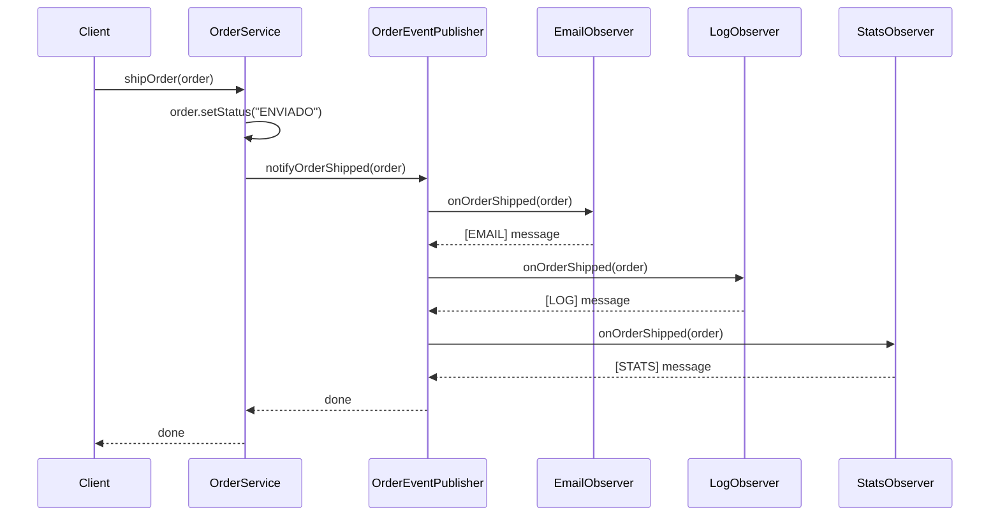

## Overview

With the Observer interface defined, we now create concrete implementations that perform specific actions when orders are shipped. This system includes three observers and a service class that coordinates the notification process.

<Info>
Each observer has a single, well-defined responsibility, demonstrating the Single Responsibility Principle in action.
</Info>

## Observer Implementations

We'll implement three concrete observers:

<CardGroup cols={3}>
  <Card title="Email Observer" icon="envelope">
    Sends email notifications to customers
  </Card>
  <Card title="Log Observer" icon="file-lines">
    Records order status changes in logs
  </Card>
  <Card title="Stats Observer" icon="chart-line">
    Tracks statistics about shipped orders
  </Card>
</CardGroup>

## 1. Email Order Observer

Sends email notifications to customers when their orders are shipped.

<Steps>
  <Step title="Implement the Interface">
    Create a class that implements `OrderObserver`.
  </Step>
  
  <Step title="Define Notification Logic">
    In the `onOrderShipped` method, implement the email sending logic.
  </Step>
  
  <Step title="Keep It Simple">
    For this demo, we use console output to simulate email sending.
  </Step>
</Steps>

```java EmailOrderObserver.java
package patron_observer.marzo_2026_2;

public class EmailOrderObserver implements OrderObserver {

    @Override
    public void onOrderShipped(Order order) {
        System.out.println("[EMAIL] Pedido " + order.getId() + " enviado. Mandando email al cliente.");
    }
}
```

<Note>
In a production system, this would integrate with an email service like SendGrid, Amazon SES, or SMTP server to send actual emails.
</Note>

### Production Enhancement Example

```java
public class EmailOrderObserver implements OrderObserver {
    private final EmailService emailService;
    
    public EmailOrderObserver(EmailService emailService) {
        this.emailService = emailService;
    }

    @Override
    public void onOrderShipped(Order order) {
        try {
            emailService.send(
                order.getCustomerEmail(),
                "Order Shipped",
                "Your order " + order.getId() + " has been shipped!"
            );
        } catch (Exception e) {
            // Log error but don't throw - don't disrupt other observers
            System.err.println("Failed to send email: " + e.getMessage());
        }
    }
}
```

## 2. Log Order Observer

Records order status changes in the system logs for auditing and debugging.

<Steps>
  <Step title="Implement the Interface">
    Create a class that implements `OrderObserver`.
  </Step>
  
  <Step title="Log Status Changes">
    Record the order ID and its new status when shipped.
  </Step>
</Steps>

```java LogOrderObserver.java
package patron_observer.marzo_2026_2;

public class LogOrderObserver implements OrderObserver {

    @Override
    public void onOrderShipped(Order order) {
        System.out.println("[LOG] Pedido " + order.getId() + " ha cambiado a estado: " + order.getStatus());
    }
}
```

<Note>
In production, replace `System.out.println` with a proper logging framework like SLF4J, Log4j, or Logback.
</Note>

### Production Enhancement Example

```java
import org.slf4j.Logger;
import org.slf4j.LoggerFactory;

public class LogOrderObserver implements OrderObserver {
    private static final Logger logger = LoggerFactory.getLogger(LogOrderObserver.class);

    @Override
    public void onOrderShipped(Order order) {
        logger.info("Order {} changed to status: {}", 
            order.getId(), 
            order.getStatus()
        );
    }
}
```

## 3. Stats Order Observer

Tracks statistics about shipped orders, maintaining a counter of total shipped orders.

<Steps>
  <Step title="Implement the Interface">
    Create a class that implements `OrderObserver`.
  </Step>
  
  <Step title="Maintain State">
    Add an internal counter to track the number of shipped orders.
  </Step>
  
  <Step title="Update Statistics">
    Increment the counter and display the updated statistics when notified.
  </Step>
</Steps>

```java StatsOrderObserver.java
package patron_observer.marzo_2026_2;

public class StatsOrderObserver implements OrderObserver {

    private int totalEnviados = 0;

    @Override
    public void onOrderShipped(Order order) {
        totalEnviados++;
        System.out.println("[STATS] Contador de pedidos enviados: " + totalEnviados);
    }
}
```

<Warning>
This observer maintains state (`totalEnviados`), which means:
- It's not thread-safe without synchronization
- The same instance should be reused to maintain accurate counts
- Consider using `AtomicInteger` for thread-safe counting
</Warning>

### Thread-Safe Enhancement

```java
import java.util.concurrent.atomic.AtomicInteger;

public class StatsOrderObserver implements OrderObserver {
    private final AtomicInteger totalEnviados = new AtomicInteger(0);

    @Override
    public void onOrderShipped(Order order) {
        int count = totalEnviados.incrementAndGet();
        System.out.println("[STATS] Contador de pedidos enviados: " + count);
    }
    
    public int getTotalShipped() {
        return totalEnviados.get();
    }
}
```

## Order Service Integration

The `OrderService` class is where the business logic meets the Observer pattern. It coordinates order operations and triggers notifications.

<Steps>
  <Step title="Depend on the Interface">
    Inject the `OrderSubject` interface, not a concrete implementation, following the Dependency Inversion Principle.
  </Step>
  
  <Step title="Execute Business Logic">
    Update the order status as part of the business operation.
  </Step>
  
  <Step title="Trigger Notifications">
    After completing the business logic, notify all observers through the subject.
  </Step>
</Steps>

```java OrderService.java
package patron_observer.marzo_2026_2;

public class OrderService {
    //interface de subject:
    private final OrderSubject orderSubject;

    public OrderService(OrderSubject orderSubject) {
        this.orderSubject = orderSubject;
    }

    public void shipOrder(Order order) {
        // lógica de negocio para "enviar" el pedido
        order.setStatus("ENVIADO");
        System.out.println("OrderService: Pedido " + order.getId() + " marcado como ENVIADO.");


        // se llama a la función de cada observer(Mail, Log, Stats) o sea 3 llamados:
        orderSubject.notifyOrderShipped(order);
    }
}
```

## Key Design Principles

<CardGroup cols={2}>
  <Card title="Dependency Inversion" icon="diagram-project">
    `OrderService` depends on the `OrderSubject` interface, not concrete implementations. This allows easy testing and flexibility.
  </Card>
  
  <Card title="Separation of Concerns" icon="layer-group">
    Business logic (updating order status) is separate from notification logic (informing observers).
  </Card>
  
  <Card title="Open/Closed Principle" icon="door-open">
    New observers can be added without modifying `OrderService` or existing observers.
  </Card>
  
  <Card title="Single Responsibility" icon="bullseye">
    Each observer has one specific job: send emails, log events, or track stats.
  </Card>
</CardGroup>

## Complete Working Example

Here's how all components work together:

```java Example Usage
// 1. Create the event publisher (Subject)
OrderEventPublisher publisher = new OrderEventPublisher();

// 2. Create concrete observers
EmailOrderObserver emailObserver = new EmailOrderObserver();
LogOrderObserver logObserver = new LogOrderObserver();
StatsOrderObserver statsObserver = new StatsOrderObserver();

// 3. Register observers with the publisher
publisher.addObserver(emailObserver);
publisher.addObserver(logObserver);
publisher.addObserver(statsObserver);

// 4. Create the service with the publisher
OrderService orderService = new OrderService(publisher);

// 5. Create and ship an order
Order order1 = new Order("ORD-001");
orderService.shipOrder(order1);

// Output:
// OrderService: Pedido ORD-001 marcado como ENVIADO.
// [EMAIL] Pedido ORD-001 enviado. Mandando email al cliente.
// [LOG] Pedido ORD-001 ha cambiado a estado: ENVIADO
// [STATS] Contador de pedidos enviados: 1

// 6. Ship another order
Order order2 = new Order("ORD-002");
orderService.shipOrder(order2);

// Output:
// OrderService: Pedido ORD-002 marcado como ENVIADO.
// [EMAIL] Pedido ORD-002 enviado. Mandando email al cliente.
// [LOG] Pedido ORD-002 ha cambiado a estado: ENVIADO
// [STATS] Contador de pedidos enviados: 2
```

## Execution Flow



## Adding New Observers

The beauty of this pattern is extensibility. Adding a new observer is simple:

```java New SMS Observer
public class SmsOrderObserver implements OrderObserver {
    @Override
    public void onOrderShipped(Order order) {
        System.out.println("[SMS] Sending SMS for order " + order.getId());
    }
}

// Usage - no changes to existing code required!
SmsOrderObserver smsObserver = new SmsOrderObserver();
publisher.addObserver(smsObserver);
```

<Note>
Adding the SMS observer doesn't require changes to:
- The `Order` class
- The `OrderSubject` interface
- The `OrderEventPublisher` class
- The `OrderService` class
- Any existing observers

This demonstrates the Open/Closed Principle in action.
</Note>

## Testing Strategies

### Testing Individual Observers

```java
@Test
public void testEmailObserver() {
    EmailOrderObserver observer = new EmailOrderObserver();
    Order order = new Order("TEST-001");
    order.setStatus("ENVIADO");
    
    // Verify no exceptions thrown
    assertDoesNotThrow(() -> observer.onOrderShipped(order));
}
```

### Testing OrderService with Mock Subject

```java
@Test
public void testOrderServiceNotifiesObservers() {
    // Arrange
    OrderSubject mockSubject = mock(OrderSubject.class);
    OrderService service = new OrderService(mockSubject);
    Order order = new Order("TEST-001");
    
    // Act
    service.shipOrder(order);
    
    // Assert
    assertEquals("ENVIADO", order.getStatus());
    verify(mockSubject).notifyOrderShipped(order);
}
```

### Integration Testing

```java
@Test
public void testCompleteNotificationFlow() {
    // Arrange
    OrderEventPublisher publisher = new OrderEventPublisher();
    AtomicInteger emailCount = new AtomicInteger(0);
    AtomicInteger logCount = new AtomicInteger(0);
    
    publisher.addObserver(order -> emailCount.incrementAndGet());
    publisher.addObserver(order -> logCount.incrementAndGet());
    
    OrderService service = new OrderService(publisher);
    Order order = new Order("TEST-001");
    
    // Act
    service.shipOrder(order);
    
    // Assert
    assertEquals("ENVIADO", order.getStatus());
    assertEquals(1, emailCount.get());
    assertEquals(1, logCount.get());
}
```

## Best Practices

<CardGroup cols={2}>
  <Card title="Constructor Injection" icon="syringe">
    Use constructor injection for dependencies (like `OrderSubject` in `OrderService`) to ensure they're always provided and make testing easier.
  </Card>
  
  <Card title="Error Handling" icon="shield">
    Observers should handle their own exceptions to prevent one failing observer from affecting others.
  </Card>
  
  <Card title="Immutable Where Possible" icon="lock">
    Consider making the `Order` object immutable or passing a defensive copy to prevent observers from modifying shared state.
  </Card>
  
  <Card title="Async Processing" icon="clock">
    For time-consuming operations (like sending emails), consider processing observer notifications asynchronously.
  </Card>
</CardGroup>

## Common Pitfalls to Avoid

<Warning>
**Memory Leaks**: If observers are long-lived objects, ensure they're properly removed when no longer needed.

**Order Dependencies**: Don't create observers that depend on the execution order of other observers.

**Modifying Shared State**: Avoid having observers modify the `Order` object, as this can create unexpected side effects.

**Blocking Operations**: Keep observer operations fast. Move slow operations (API calls, database writes) to background threads.
</Warning>

## Next Steps

You now have a complete Observer pattern implementation! Consider:

- Adding more event types (order created, cancelled, delivered)
- Implementing async notification with `CompletableFuture` or message queues
- Adding priority-based observer execution
- Implementing a filtering mechanism so observers only receive relevant events
- Adding metrics and monitoring to track observer performance
