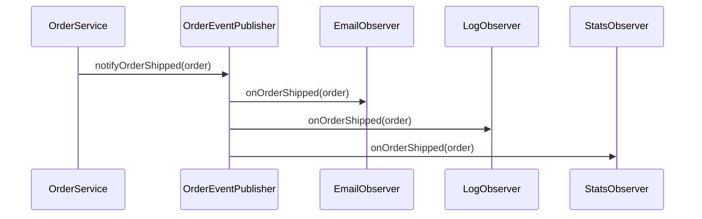

## Overview

The Subject is a core component of the Observer pattern. It maintains a list of observers and provides methods to register, unregister, and notify them when events occur.

<Info>
In this implementation, we separate the Subject contract (interface) from its concrete implementation (publisher), following the Interface Segregation and Dependency Inversion principles.
</Info>

## Architecture

We implement the Subject using two components:
1. **OrderSubject** - Interface defining the contract
2. **OrderEventPublisher** - Concrete implementation managing observers

## Subject Interface

<Steps>
  <Step title="Define the Interface Contract">
    Create an interface that declares three essential methods for observer management and notification.
  </Step>
  
  <Step title="Observer Registration">
    Provide methods to add and remove observers dynamically at runtime.
  </Step>
  
  <Step title="Event Notification">
    Define a method to notify all registered observers when an order is shipped.
  </Step>
</Steps>

### OrderSubject Interface

```java OrderSubject.java
package patron_observer.marzo_2026_2;

// subject

public interface OrderSubject {
    void addObserver(OrderObserver observer);
    void removeObserver(OrderObserver observer);
    void notifyOrderShipped(Order order);
}
```

<Note>
The interface defines the "what" (contract) without specifying the "how" (implementation details). This allows for different implementations and easier testing with mocks.
</Note>

## Event Publisher Implementation

The `OrderEventPublisher` is the concrete implementation of the `OrderSubject` interface. It maintains the list of observers and handles the notification logic.

<Steps>
  <Step title="Implement the Interface">
    Create a class that implements `OrderSubject` and maintains an internal list of observers.
  </Step>
  
  <Step title="Manage Observer Collection">
    Use an `ArrayList` to store registered observers, allowing dynamic addition and removal.
  </Step>
  
  <Step title="Implement Notification Logic">
    When notifying, iterate through all observers and call their update method with the order data.
  </Step>
</Steps>

### OrderEventPublisher Implementation

```java OrderEventPublisher.java
package patron_observer.marzo_2026_2;

import java.util.ArrayList;
import java.util.List;

public class OrderEventPublisher implements OrderSubject {

    private final List<OrderObserver> observers = new ArrayList<>();

    @Override
    public void addObserver(OrderObserver observer) {
        observers.add(observer);
    }

    @Override
    public void removeObserver(OrderObserver observer) {
        observers.remove(observer);
    }

    @Override
    public void notifyOrderShipped(Order order) {
        for (OrderObserver observer : observers) {
            observer.onOrderShipped(order);
        }
    }
}
```

## How It Works

<CardGroup cols={2}>
  <Card title="Observer Storage" icon="database">
    A private `ArrayList` stores all registered observers. The list is final but its contents can be modified.
  </Card>
  
  <Card title="Dynamic Registration" icon="plus">
    Observers can be added at any time using `addObserver()`, allowing flexible configuration at runtime.
  </Card>
  
  <Card title="Dynamic Unregistration" icon="minus">
    Observers can be removed using `removeObserver()`, useful for cleanup or disabling specific notifications.
  </Card>
  
  <Card title="Broadcast Notifications" icon="broadcast-tower">
    The `notifyOrderShipped()` method iterates through all observers and invokes their callback method.
  </Card>
</CardGroup>

## Usage Example

```java
// Create the event publisher
OrderEventPublisher publisher = new OrderEventPublisher();

// Create observers
EmailOrderObserver emailObserver = new EmailOrderObserver();
LogOrderObserver logObserver = new LogOrderObserver();
StatsOrderObserver statsObserver = new StatsOrderObserver();

// Register observers
publisher.addObserver(emailObserver);
publisher.addObserver(logObserver);
publisher.addObserver(statsObserver);

// Create an order
Order order = new Order("ORD-001");
order.setStatus("ENVIADO");

// Notify all observers
publisher.notifyOrderShipped(order);
// All three observers will be notified simultaneously

// Remove an observer
publisher.removeObserver(emailObserver);

// Future notifications won't include emailObserver
publisher.notifyOrderShipped(order);
```

## Design Patterns & Principles

### Interface Segregation Principle

By defining `OrderSubject` as an interface, we separate the contract from the implementation. This allows:
- Easy mocking for unit tests
- Multiple implementations if needed
- Loose coupling between components

### Notification Flow



<Warning>
Important considerations:
- Observers are notified **sequentially** in the order they were added
- If an observer throws an exception, subsequent observers may not be notified
- Consider error handling strategies for production systems
- For async notifications, consider using a thread pool or message queue
</Warning>

## Thread Safety Considerations

<Note>
The current implementation is **not thread-safe**. If you need to add/remove observers from multiple threads or notify observers concurrently, consider:
- Using `CopyOnWriteArrayList` instead of `ArrayList`
- Synchronizing methods with `synchronized` keyword
- Using concurrent collections from `java.util.concurrent`
</Note>

## Best Practices

1. **Null Checks**: Add null validation when adding observers
2. **Duplicate Prevention**: Check if an observer is already registered before adding
3. **Error Handling**: Wrap observer notifications in try-catch to prevent one failing observer from affecting others
4. **Logging**: Add logging to track observer registration/removal for debugging

## Next Steps

Now that we have the Subject interface and its implementation, we'll define the Observer interface that all concrete observers must implement.
